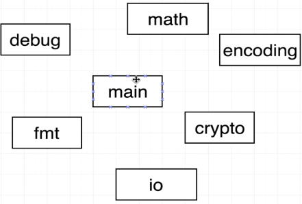

1.How do we run program in Go?

We use go run cmd to execute program
But there is another cmd named go build, While go run compiles and execute program, go build only compilers it into runnable .exe file (requires package main)
to run the built file, just write the name in terminal

2.What is package main?

There are mainly two types of packages in Go
1.Executable (Generates a file we can run)
2.Reusable (Code used as 'helpers', a place to put reusable logics, or like dependencis)
package main means its executable, and other name than main means dependency or helper

3.What does import fmt means?

The import statement is used to get access or other codes written.
Import fmt specifically means, give my package '...' access to all codes and functions contains in the other package called "fmt".
"fmt" is a standard library package used by go.
we can use it to printout a lot of information,bebugging etc

4.What is func thing?

func means functions.

5.How is the main.go file organized

package ---
import ---
funct ---(){
}